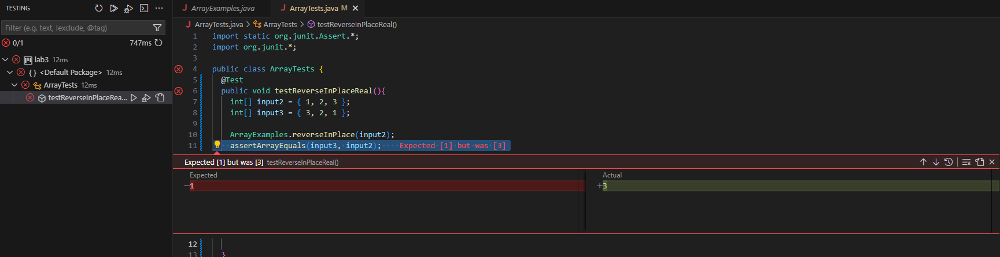
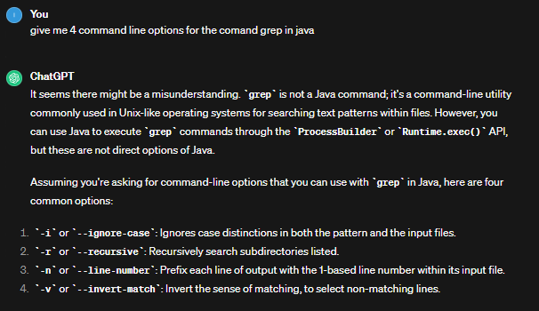

Arrays and bugs
===============

This is the buggy code we are working with:

`static void reverseInPlace(int[] arr) {
    for(int i = 0; i < arr.length; i += 1) {
      arr[i] = arr[arr.length - i - 1];
    }
  }`

The purpose of this code is to reverse the order of an array.
ex.

`oldArray = { 1, 2, 3 };
 newArray = { 3, 2, 1 };`

but when we try to use this in a `jUnit` test it does not work as it gives an error message. Like follows.
The `jUnit` test:

`@Test
  public void testReverseInPlaceReal(){
    int[] input2 = { 1, 2, 3 };
    int[] input3 = { 3, 2, 1 };
    ArrayExamples.reverseInPlace(input2);
    assertArrayEquals(input3, input2);
  }`
  
error message:
`There was 1 failure: 1) testReverseInPlaceReal(ArrayTests)
arrays first differed at element [2]; expected:<1> but was:<3>`

However if we only use an array with a singular piece of data the `jUnit` test properly runs.
The Junit test:
`@Test 
	public void testReverseInPlace() {
    int[] input1 = { 3 };
    ArrayExamples.reverseInPlace(input1);
    assertArrayEquals(new int[]{ 3 }, input1);
	}`
 
message:
`JUnit version 4.13.2
.
Time: 0.005
OK (1 test)`

This is how the symptom looks when we run it in `vscode`:

This is the difference between the buggy code and the new and improved fixed code
Buggy:
`static void reverseInPlace(int[] arr) {
    for(int i = 0; i < arr.length; i += 1) {
      arr[i] = arr[arr.length - i - 1];
    }
  }`

  Fixed:
  `static void reverseInPlace(int[] arr) {
    int temporal;
    for(int i = 0; i < arr.length / 2; i += 1) {
      temporal = arr[i];
      arr[i] = arr[arr.length - i - 1]; 
      arr[arr.length - i - 1] = temporal;
    }
  }`

What we fixed in the code is that we would store the `value` of the `current index` in a temporal `variable` called `temporal`.
We later `loop` through the `array`,but only until half of it because otherwise it would continue displacing values even when it is not supposed to.
in the loop we assign the `temporal` `value` to the `current index value` just so we can use it later when `assigning` the last `value` to the first one.
After that we set the `value` of the `current index` to the `value` of the `last index` by using the `variable` i that gets bigger with each `loop` making it able to go through all the desired `indexes`.

Wth these changes the code is now fixed!

Now we dive into the second part of the lab report. 4 interesting command-line options for commands! in this occassion I will use the command Grep with the help of my good friend chat-gpt. I asked chat gpt about intereseting command line arguments for grep and it responded with this:

Lets try and analyse this.

number one
==========

The first point ignores case in the prompt, which means you can yell at the terminal and it would still give out the same results
`grep -i "pattern" FILENAME.TXT`

number 2
========

The second one checks recursively for a pattern in a directory, it is really useful when navigating through a lot of directories
`grep -r txt folder`

number 3
========

The third one returns the entire line by the lione given such as this:
lines:
`1 hola
 2 hello
 3 こんいちは`

command:
`grep -n 2 exampleFile.txt`

This would return:
`2 hello`

number 4
========
Using the same lines as before if we use `v` it would just ommit the line. So unstead of 1, 2, and 3.
command:
`grep -v 2 exampleFolder.txt`

the result would be this:
`1 hola
 3 こんいちは`

 Thanks for reading this lab report.
 

