Loging into `ieng6`
===================

In order to log in to `ieng6` we need to type `ssh` followed by the email.
Like this:

`ssh alopezvazquez@ieng6.ucsd.edu`

Here is a visual representation:

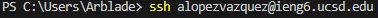

After putting the correct email it will ask us a password.
ex.

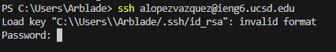

After succesfully inputting the correct password we will be recieved with this:

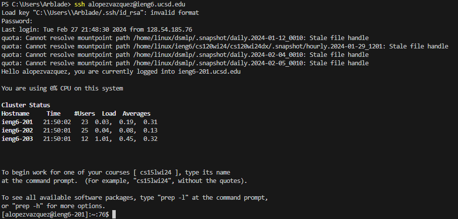

Cloning the repository
======================

To succesfully clone the repository we need to use the `git clone` command followed by the address of the repository. Except that we do not need the address of the repository, what we need is the `ssh` which is just besides the address in github.
ex.

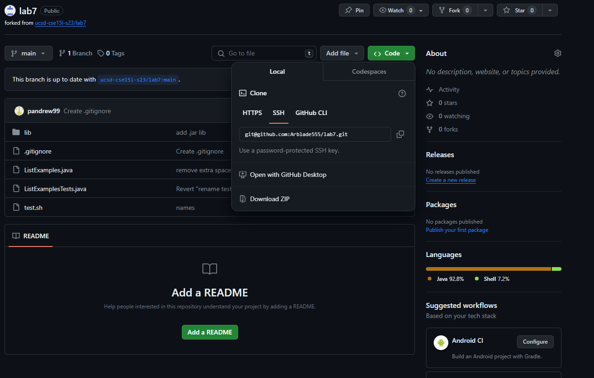

Now that we have the correct thing to copy, we now copy the repository by typing this into our machine `git clone git@github.com:Arblade555/lab7.git`
ex.

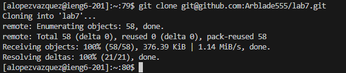

Now that we have `lab7` cloned we can see where it has been stored by using `ls`
ex.

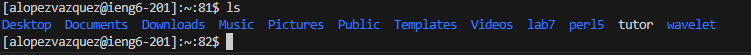

we can now `cd` into `lab7` and see its contents by using `ls` again

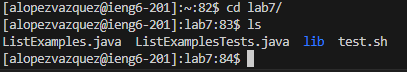

Running the tests
=================

We can now run `test.sh` with `bash`. We do this because `test.sh` has the necessary commands to execute the test files in order.
ex.

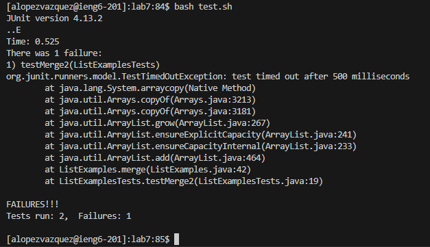

We can see that there was one error in the tests. The error is found in ListExamples.java specifically in the last `while loop`. 

Editing the file
================

In order to access and edit ListExamples.java from the terminal we need to use `vim`
ex.

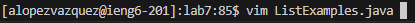

Once we hit enter we can see that the whole terminal is the file and we can not move the screen or select anything. This is because it uses a whole different system of navigation because everything is being seen by the terminal. 
ex.

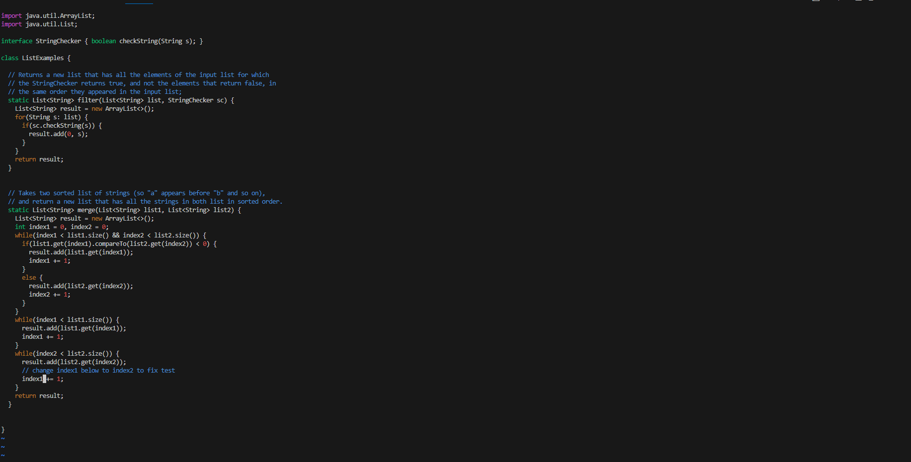

To move up we use `k`, to move down we use `j`, to move left we use `h` and finally to move right we use `l`
In order to arrive to the faulty part of the code we need to input as follows:
`down, down, down, down, down, down, down, down, down, down, down, down, down, down, down, down, down, down, down, down, down, down, down, down, down, down, down, down, down, 
down, down, down, down, down, down, down, down, down, down, down, down, down, down`

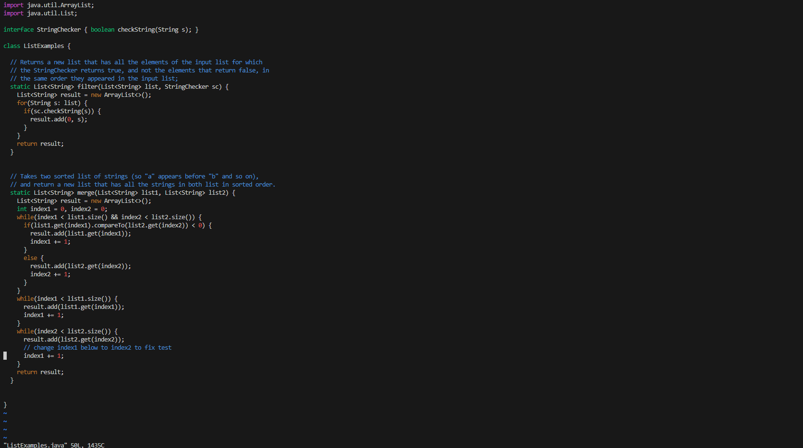

We have arrive at the line where the code is faulty, we now need to change `index1` to `index2`. To do this we need to move as follows:
`right, right, right, right, right, right, right, right, right, right, right`
We have arrived at the character we need to change. 

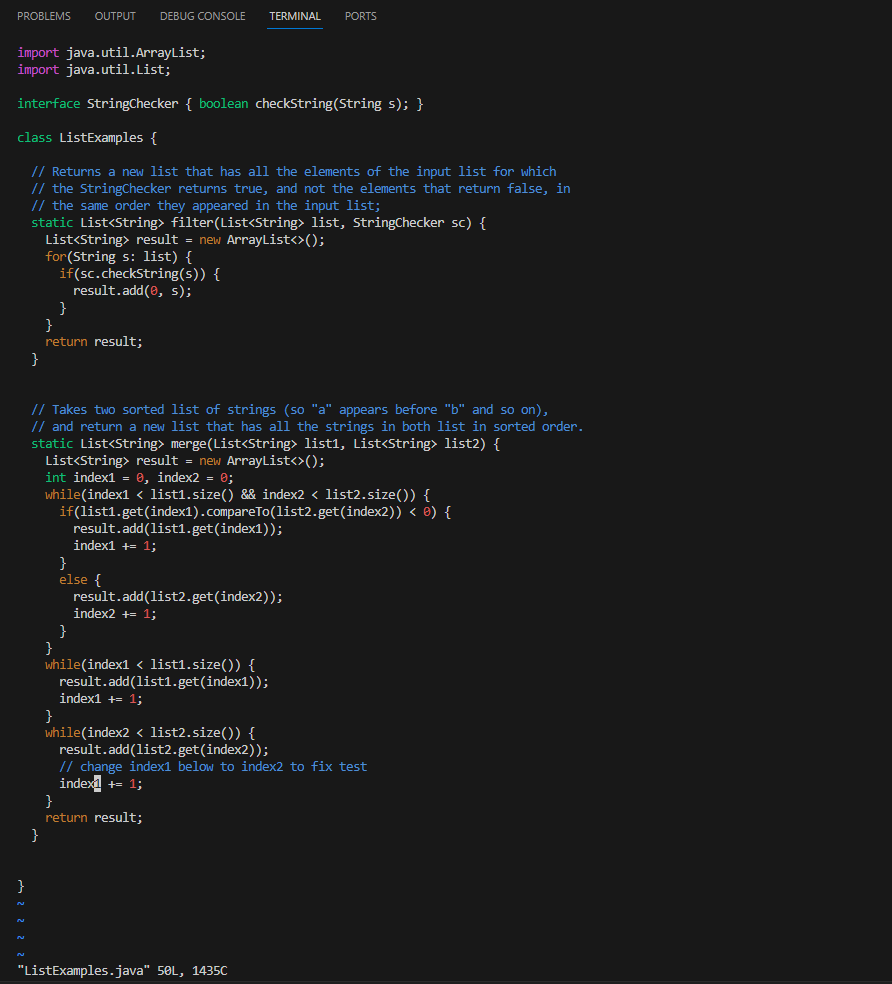

We can eliminate the character by pressing `x`

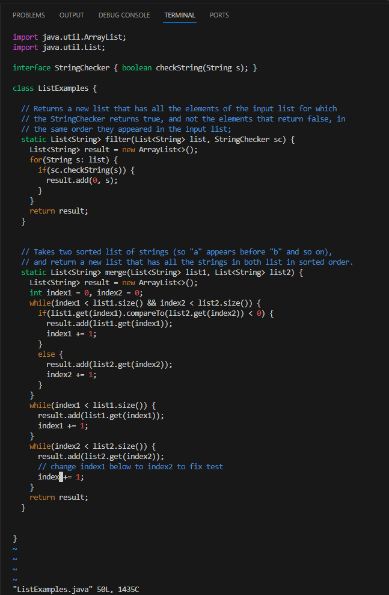

Now we can add the 2 in order to fix the code by pressing `i` which will let us modify the code and insert the number 2

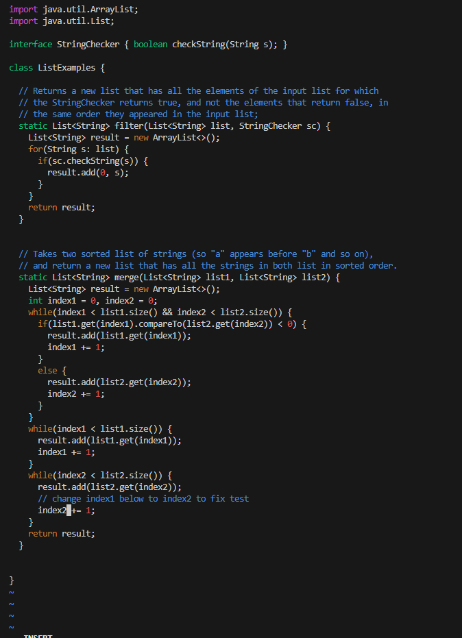

To exit editing mode we need to press the `esc` key. Now when we are out we need to save and quit. We do this by pressing `SHIFT + ;` followed by `w, q` if we did this correctly we should be outside the file and back were we started

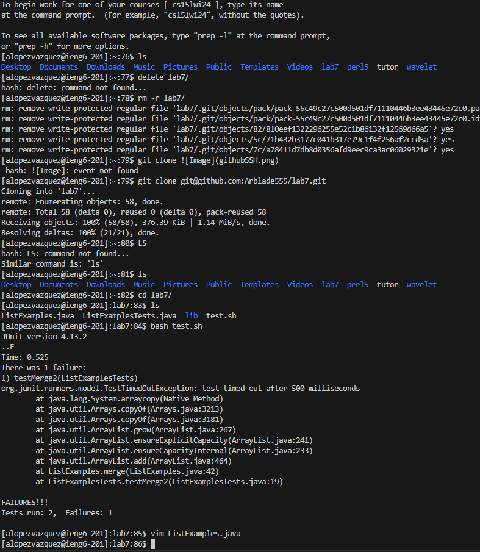

Re-running the tests
====================

Now that we have succesfully edited and saved the faulty code, we can re-compile the code and see if it works now. We can do this by re-doing the steps in Running the tests
the result:

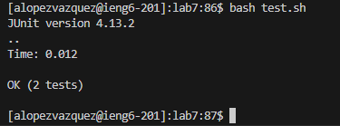

GREAT!

Committing and pushing to GitHub
================================

We can push and commit to github by using the commands `git push` and `git commit file` we just replace `file` with the name of the file
ex.

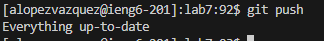

Once we have pushed we can commit. Once we type `git commit ListExamples.java` in the terminal, we are taken to a weird place. This is just the place to put a commit message. We can put anything. We just need to press `i` and start typing.
Once we are done we can press `ESC` to get out of editing. After that we can just use the same sequence we used to exit out of the `ListExamples.java`. That being `SHIFT + ;` followed by `w, q`. We should have succesfully commited the file with a commit message
ex.

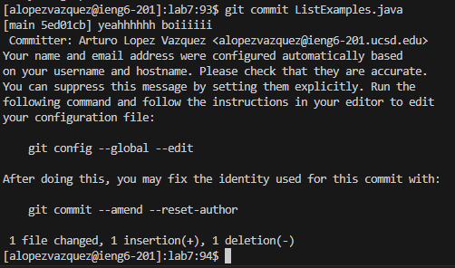

Now we can exit out of ieng6 by typing `exit` on the terminal and done!
We have succesfully edited and committed a file that was not on our desktop!
man I love the cloud

