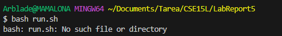
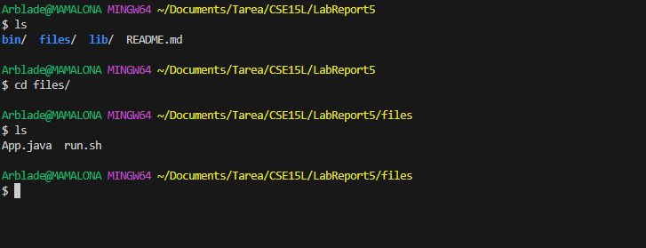
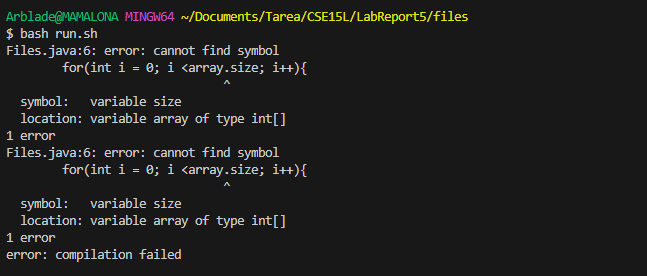
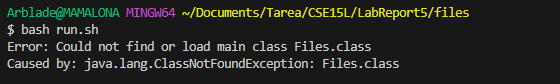
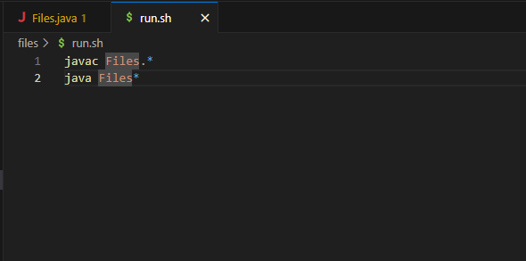
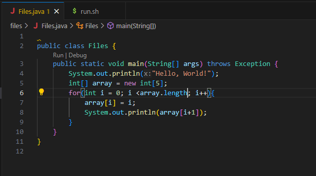
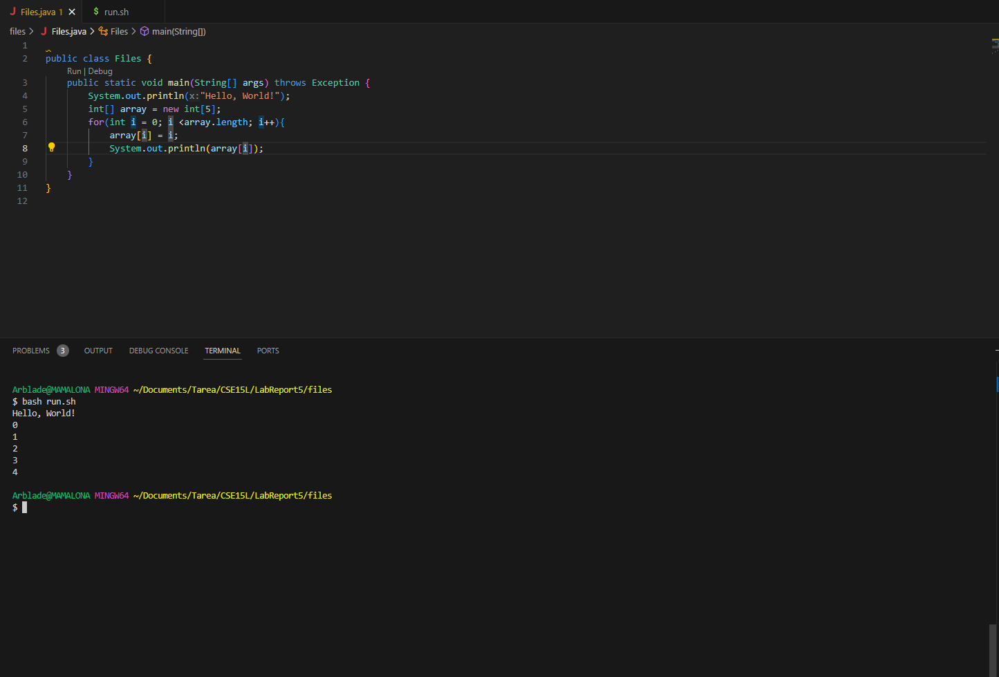
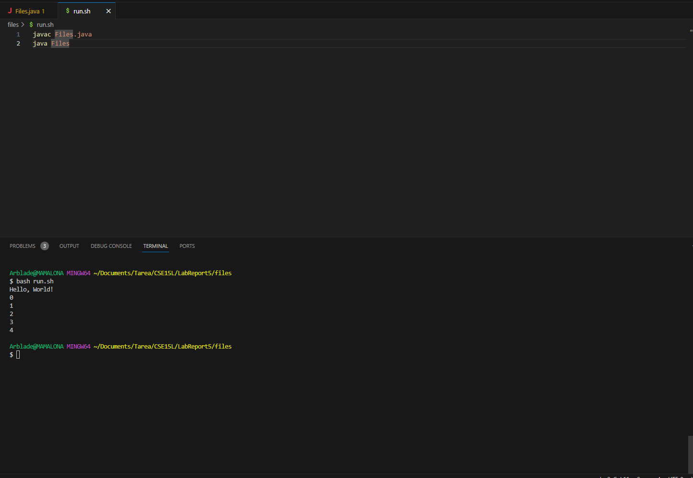

Piazza
======

`Student:` I have written some code but I keep getting an error message whenn I try to run the bash file, what can I do?
  

`TA:`I can definetly help you with that, maybe you are in the wrong directory? you should check your files directory to the side of the code. 
If you can't you can always use `ls` in the terminal to see what directories and/or files are available and later use `cd` to go into whichever directory you want.

`Student:` Oh yeah, lemme do that.
  

I have changed from the main directory into the correct directory but I keep getting this message, what can I do?

  

`TA:`It seems that you have confused the `.size()` method with the `.length` used for arrays. Try replacing it with the correct thing

`Student:`Thanks.
I have done that but there is still errors
  

`TA:`Can I see your code? it's a bit difficult to offer help otherwise

`Student:`Oh yeah sorry about that. Here is the code for the bash script and my code for the program
  
  
  

`TA:`It seems that in the bash script you are trying to compile every file with the name `Files` but because java creates a `.class` file when you compile a java program, you are telling the bash script to also run the `.class` file. 
What you should do is remove the `.*` and replace it with the according `.java` in the compile command and just remove `.*` for the run command.
I also saw that your main program could lead to an error with an `IndexOutOfBounds` error. If you want to print the current index you can just get rid of the `+1` in the `System.out.println()` command.
Please send an image of your code after you fix it and try running it. This works to prove that I am doing an excellent job as a TA.

`Student:`I have fixed everything you told me and now it runs perfectly and now it runs, thanks :D
Here are the images:

  

  

REFLECTION
==========
Honestly everything I learned in class was new. From the bash commands to how to make an autograder. I still struggle a bit with bash but this has been a great learning experience for me. I will definitely need to use this knowledge when I forget everything about it.
The instructor was really cool and the TAs too! Huge shoutouts to Yasushi for giving a TedTalk on which CS classes are good, which are difficult and what classes are chill.
Thanks for the class, hope you have a great day!
