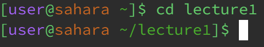
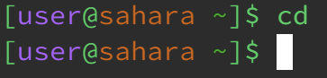
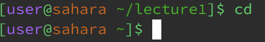
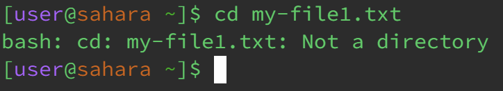
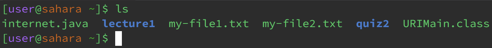
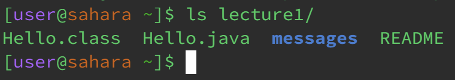
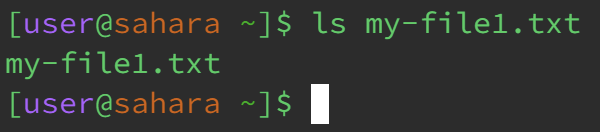
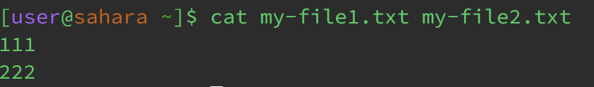
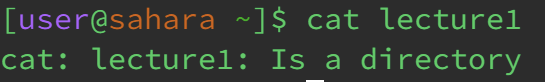
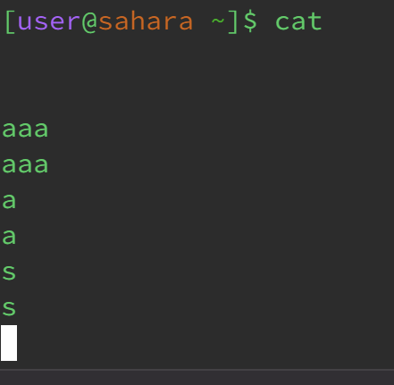

cd
==

Using `cd` as intended

We use the command `cd` in order to `Change Directory`. Ussually the default directory is `/home` but it ussually isn't seen in the terminal, just like in this case. When we put `arguments` after the command, we can change the directory from the default `/home` into the desired one. `Arguments` are the names of files or directories that are given to the given command. The output we see its not an error, it is the expected result.

Using `cd` without `arguments`

The moment we use `cd` without `arguments` we can see that the terminal does nothing. Or so it appears, as the command `cd` without arguments is just `cd /home` that's why we don't see anything happening because we are already at `/home` which is the default and starting directory. This is an intended result and there is no errors. 
If we are already in a `directory` and use `cd` without `arguments` we can see that the terminal goes back to default

Using `cd` with wrong `arguments`

Not all arguments are correct arguments. In this case we start of with the default directory, but if we use a `file` as an `argument` instead of a `directory`, we can see that it'll give us an error message. This error message gives us information on why the command didn't work as intended. This error happened because we cannot `cd` into a file, we can only `cd` into directories. 

ls
==

Using `ls` without `arguments`

We can use `ls` in many ways even without `arguments`! we can do this because `ls` is `list`, which gives us a list of whats in the `working directory` (the current directory we are in). The seen output lists whats in my working directory `/home`, the highlighted words are other `directories` in which we can `cd` into.

Using `ls` with a `directory`

We can also use `ls` on `directories` in order to list what is inside of the `directory`. The output we see is just what is inside the given `directory`. It doesn't matter where we start as long as the `directory` is not within another `directory`. I am in the default directory `/home`.

Using `ls` with a `file`

Something funny happens when we use `ls` with a `file`.

We startout in the default directory, `/home`. The `output` we see is the name of the file. This happens because what the `ls` essentialy does is list stuff, but when we only give it one thing to list it will only list that one thing. This may seem like an error but it is the expected output.

cat
===

Using `cat` as intended.

We can use `cat` in order to show the contents of one or many `files` in the `terminal` without modifying it. I am in the default directory `/home` and using `cat` on two different `files` gives me the content of these files in the terminal one after another, this is the expected output.

Using `cat` with a `directory`

If we try to use `cat` on a directory it'll give us an error message no matter where we start of (I am starting in the default `directory ` `/home`) This error tells us that we cannot use `cat` on a directory, this is because we cannot show the contents of a directory. It is like trying to get inside a street the same way we get inside a house, we just cannot.

Using `cat` by itself

Something really fun happens if we use `cat` without any `arguments`.

The terminal goes blank and we can start typing. If we type something and press `enter` the terminal will copy the text and display it underneath the one we typed ourselves. I am in the default `directory` `/home`. This is the intended output of the command. In order to exit and stop typing we can just press `ctrl` + `c`.

Thanks for reading this lab report :D

